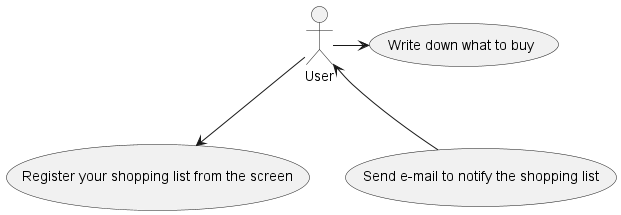
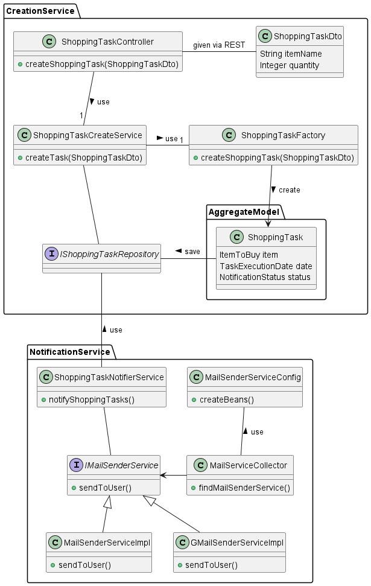
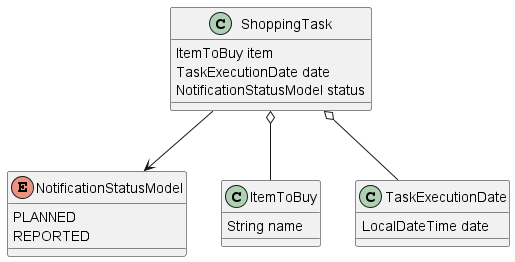

# shopping-elephant
## Overview
This Web application registers items to be purchased 
and notifies you when they are needed.
The name of the application is taken from the phrase "Elephant in the room," which is a big thing, but be forgotten.

## Service

The application provides the function of;  
- Record items to be purchased
- Set notification time in advance
- Notification of planned purchases at specified times

It prevents the inadvertent mistake of saying, "I should have bought it then".  

## User Interface
**TBD**

## Controller
The Controller obtains registered item information via REST, and the JSON-deserialized information is passed to the Service layer.

## Development
This application is built with the environment bellow;
### Back end
- OpenJDK 17.0.7
- Spring boot 3.1.1
- IntelliJ IDEA 2023.1.2
- embedded H2DB 2.2.220

### Front end
**TBD**

### Architecture
  
The architecture of this program is based on Domain driven development model.
There is only one aggregate model to manage the expiration date.

This application is built with the Clean Architecture, this is the first attempt for me to develop with this model.
- adapter : perform as a gateway that input in UI
- application : contains use-case, perform as a business logic
- domain : entity, model(enum), specification, that describes the knowledge of components

### Aggregate pattern  
  